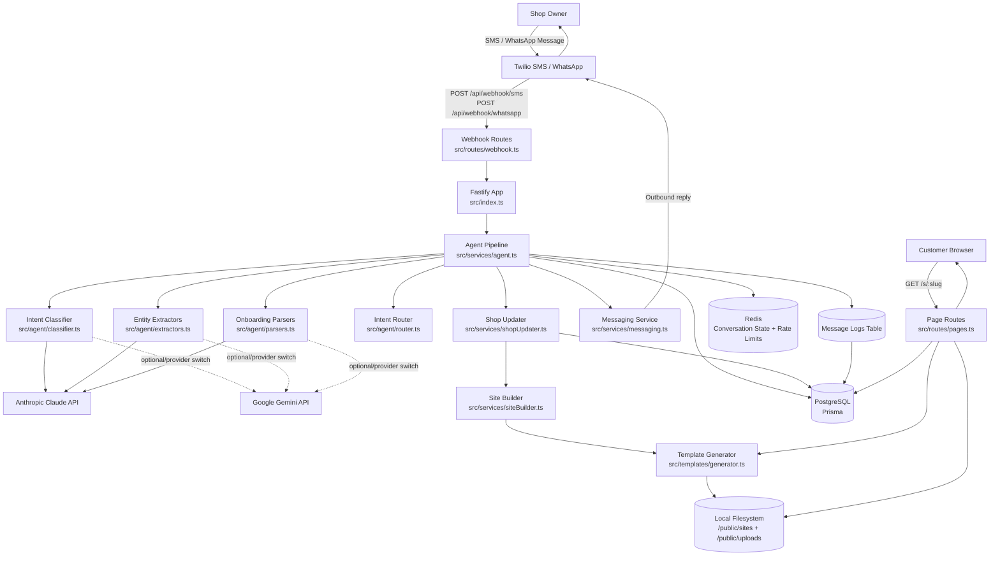
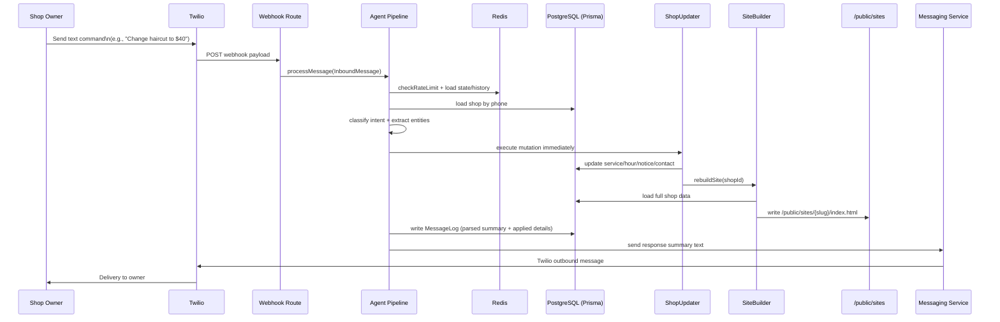

# Shopfront System Architecture

This document maps the key technical components in Shopfront and how they interact across messaging, AI processing, data storage, and website publishing.

## 1) High-Level System Diagram

## 2) Request-to-Website Update Flow

## 3) Component Responsibilities

- `Fastify API` (`src/index.ts`): bootstraps env/config, routes, middleware, logger, health/metrics.
- `Webhook Routes` (`src/routes/webhook.ts`): validates inbound provider requests, normalizes payload, calls agent pipeline.
- `Agent Pipeline` (`src/services/agent.ts`): orchestrates rate limits, conversation state, intent parsing/classification, and response generation.
- `Classifier / Extractors / Parsers` (`src/agent/*`): convert natural language into structured intents/entities for onboarding and updates.
- `ShopUpdater` (`src/services/shopUpdater.ts`): applies validated DB mutations and triggers rebuilds.
- `SiteBuilder + Template Generator` (`src/services/siteBuilder.ts`, `src/templates/generator.ts`): generates static HTML from DB data and stores output.
- `Messaging Service` (`src/services/messaging.ts`): provider abstraction for outbound SMS/WhatsApp (and future channels).
- `Pages Route` (`src/routes/pages.ts`): serves prebuilt page from disk if available, else generates and caches.

## 4) Data/State Topology

- `PostgreSQL (Prisma)` stores:
  - Shops, Services, Hours, Notices
  - Message logs for audit/debug visibility on site logs
  - Failed messages (dead-letter flow)
- `Redis` stores:
  - Per-phone conversation state
  - Last messages history (context window)
  - Rate-limit counters (per hour)
- `Filesystem` stores:
  - `public/sites/{slug}/index.html` (prebuilt public pages)
  - `public/uploads/{shopId}/...` (processed media assets)

## 5) Key Integration Boundaries

- Messaging ingress/egress boundary: Twilio webhooks + outbound API calls.
- LLM boundary: provider SDK/API calls for parsing/classification/extraction.
- Persistence boundary: Prisma for durable records, Redis for transient state.
- Rendering boundary: template generation + static file serving.

## 6) Operational Notes

- Rebuild trigger points are attached to successful mutations (services, hours, notices, contact, photo, onboarding completion).
- Public route `GET /s/:slug` supports cache-friendly serving with metadata headers.
- Message logs preserve parsed intent and applied update details for traceability.
