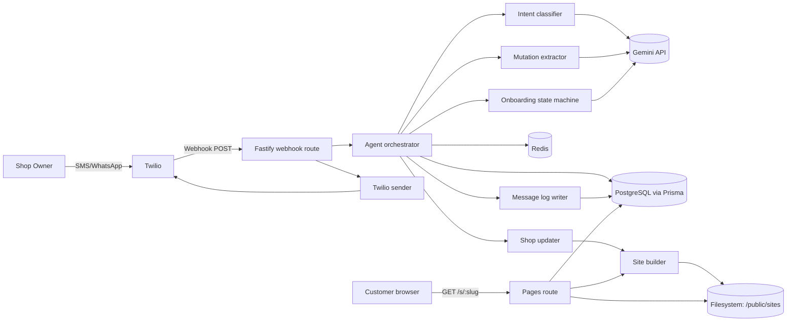
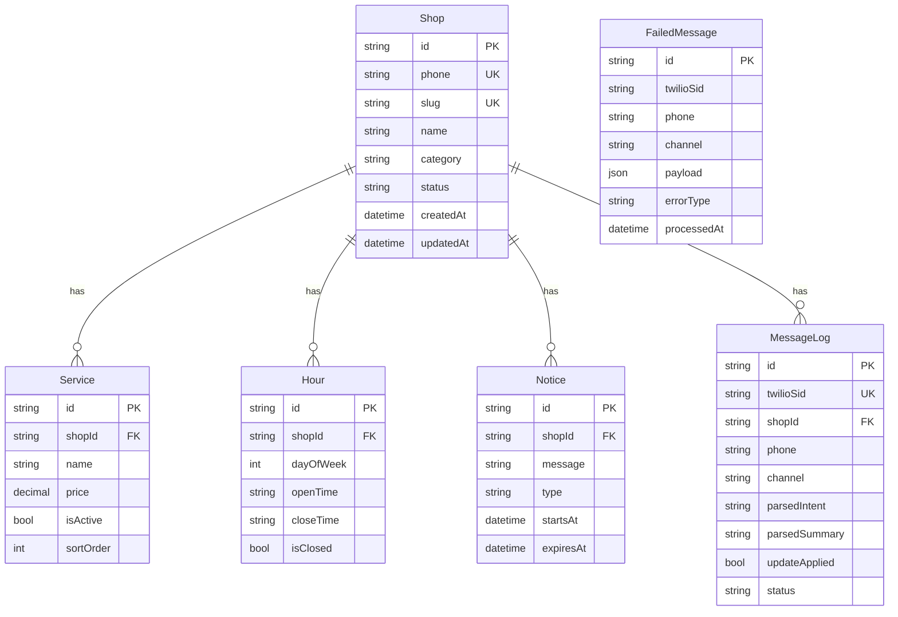
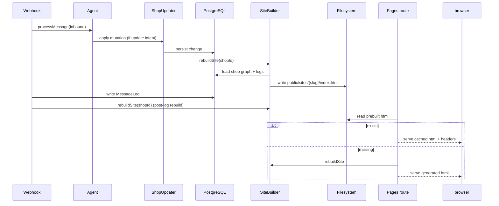

# Shopfront System Architecture (Code-Accurate)

This document reflects the current implementation in `src/`, `prisma/`, and `scripts/`.

## 1) Product Runtime Scope

Shopfront is a Twilio-first text-to-website system for small businesses.

- Inbound channels: `sms`, `whatsapp`
- Inbound endpoints: `POST /api/webhook/sms`, `POST /api/webhook/whatsapp`
- Public website endpoint: `GET /s/:slug`
- Preview endpoint: `GET /preview/:shopId`
- Health/ops endpoints: `GET /health`, `GET /metrics`

## 2) High-Level Component Topology

## 3) Core Runtime Services

- `src/index.ts`
  - Fastify app assembly, static `/public/`, CORS, Helmet, formbody, routes
  - Request counting and `/metrics` backing data
  - Graceful shutdown for Fastify + Redis + Prisma

- `src/routes/webhook.ts`
  - Twilio signature validation (`twilio.validateRequest`)
  - Inbound normalization to `InboundMessage`
  - Calls `processMessage()` with retry (`PROCESS_RETRY_LIMIT = 3`)
  - Writes `MessageLog` with parsed summary/status
  - Rebuilds site after logging (when shop id exists)
  - Sends outbound response via Twilio sender
  - Dead-letter enqueue on repeated failure

- `src/services/agent.ts`
  - Orchestrates rate limiting, state/history, onboarding vs active handling
  - For existing shops:
    - media/photo handling path
    - classify intent
    - query response path
    - mutation extraction + immediate execution path
  - Uses Redis state and history for context

- `src/services/shopUpdater.ts`
  - Applies validated DB mutations (services/hours/notices/contact)
  - Fuzzy service matching for update/remove
  - Triggers `touchAndRebuild()` for most mutations

- `src/services/siteBuilder.ts`
  - Loads full shop graph + logs
  - Generates static HTML via template generator
  - Writes to `{SITE_OUTPUT_DIR}/{slug}/index.html`

- `src/routes/pages.ts`
  - Serves prebuilt HTML with cache headers (`Cache-Control`, `ETag`, `Last-Modified`)
  - If missing prebuilt file, triggers rebuild and fallback generation

## 4) Conversation and State Model

Redis keys:

- `state:{phone}` - serialized `ConversationState`, TTL 24h
- `history:{phone}` - last 10 messages, TTL 7d
- `rate:{phone}` - per-hour inbound counter, limit 20/hr

Conversation modes:

- `onboarding`
- `active`
- `awaiting_confirmation` (still used for photo target choice and transient mutation execution)

## 5) Onboarding State Machine (Implemented)

`src/agent/onboarding.ts` supports these steps:

1. Welcome + business name
2. Category
3. Services parse
4. Services confirm/correct
5. Hours parse
6. Address
7. Complete -> create/update shop + services + hours + rebuild site

Shortcut behavior:

- After business name is captured (`step >= 2`), `Done` finalizes with placeholders:
  - default category if missing
  - placeholder services/hours/address if missing

## 6) Mutation and Query Handling

### 6.1 Intent Classification

`src/agent/classifier.ts`:

- Hybrid approach:
  - heuristic classifier first
  - Gemini JSON classification attempt
  - fallback to heuristic on failure/invalid output
- Clarification triggered if confidence < 0.7
- Media + photo language can force `update_photo`

### 6.2 Entity Extraction

`src/agent/extractors.ts`:

- Hybrid extraction:
  - Gemini schema-guided JSON extraction
  - heuristic extractor fallback per intent
- Validation pass normalizes extracted data before execution

### 6.3 Execution behavior

For mutation intents, agent currently executes immediately after successful extraction.

- No final yes/no confirmation loop for standard mutations
- Photo uploads without explicit banner/gallery do ask a follow-up choice

## 7) Data Model (Prisma)

Primary entities in `prisma/schema.prisma`:

- `Shop` (tenant keyed by unique owner phone)
- `Service` (soft-delete via `isActive`)
- `Hour` (unique `(shopId, dayOfWeek)`)
- `Notice` (active via `expiresAt` filtering)
- `MessageLog` (audit trail shown on site logs section)
- `FailedMessage` (dead-letter queue for replay)

## 8) Website Build and Serving Pipeline

Important current behavior:

- Rebuild can happen both in mutation updater and again after webhook log write.
- This ensures logs are reflected quickly on public pages, but can duplicate rebuild work.

## 9) Observability, Errors, and Recovery

- Structured logging via `pino` (`src/lib/logger.ts`)
- Sentry optional in prod (`src/lib/observability.ts`, requires `SENTRY_DSN`)
- Friendly fallback messaging by error class (`src/routes/webhook.ts`)
- Dead-letter queue in `FailedMessage`
- Replay script: `scripts/replay-failed.ts`

## 10) Security and Validation Boundaries

- Twilio signature validation enforced unless `SKIP_TWILIO_VALIDATION=true`
- Twilio send can be disabled with `SKIP_TWILIO_SEND=true`
- Media download authenticated with Twilio basic auth
- Media constraints:
  - formats: jpeg/jpg/png/webp
  - size <= 10MB
  - output normalized to webp + thumbnail via Sharp

## 11) Deployment and Operations

- Docker multi-stage build (`Dockerfile`)
- CI/CD GitHub Actions (`.github/workflows/deploy.yml`)
  - postgres + redis service containers
  - migrate, lint, test, build
  - optional Railway deploy by secrets
- Runtime env validation in `src/config.ts`

## 12) Known Design Notes and Gaps

- `README.md` stack text still mentions Anthropic; runtime code uses Gemini (`src/lib/gemini.ts`).
- `src/models/types.ts` currently includes only `sms | whatsapp` channel.
- `src/templates/generator.ts` JSON-LD has duplicate `@type` in openingHoursSpecification item; functional but should be cleaned.
- `src/agent/router.ts` still returns placeholder text for non-mutation intent handling paths; primary mutation path is handled directly in `agent.ts`.

